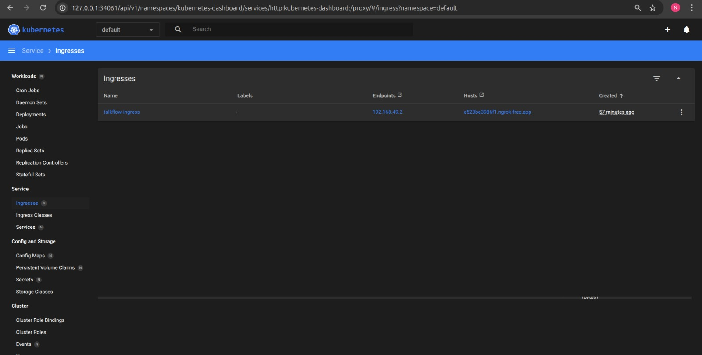

# TalkFlow

A local AI chat application that uses Ollama to run language models locally and exposes a FastAPI backend with a React + Vite frontend.

## Quick links
- Backend entry: [`app`](backend/app/main.py) — [backend/app/main.py](backend/app/main.py)  
- Frontend main component: [`OllamaChat`](frontend/src/App.tsx) — [frontend/src/App.tsx](frontend/src/App.tsx)  
- Frontend package: [frontend/package.json](frontend/package.json)  
- Backend requirements: [backend/requirements.txt](backend/requirements.txt)  
- Dockerfiles: [frontend/Dockerfile](frontend/Dockerfile), [backend/Dockerfile](backend/Dockerfile)  
- K8s manifests: [k8s/ollama-deployment.yaml](k8s/ollama-deployment.yaml), [k8s/ollama-pv-pvc.yaml](k8s/ollama-pv-pvc.yaml), [k8s/storage-pv-pvc.yaml](k8s/storage-pv-pvc.yaml), [k8s/frontend-deployment.yaml](k8s/frontend-deployment.yaml), [k8s/backend-deployment.yaml](k8s/backend-deployment.yaml), [k8s/ingress.yaml](k8s/ingress.yaml)

## Overview
TalkFlow consists of:
- A FastAPI backend that proxies and manages sessions with Ollama ([backend/app/main.py](backend/app/main.py)).
- A React + Vite frontend that streams model output and manages chat sessions ([frontend/src/App.tsx](frontend/src/App.tsx)).

## Local development

Prerequisites
- Ollama running locally (e.g. `ollama serve`)
- Python 3.11+, Node 20+, npm

Backend
1. Install deps:
   pip install -r backend/requirements.txt
2. Start server:
   uvicorn app.main:app --reload --host 0.0.0.0 --port 8000
3. Set OLLAMA_HOST env to change Ollama address (default used in code is from env: `OLLAMA_HOST`).

Frontend
1. Install deps:
   cd frontend && npm install
2. Start dev server:
   npm run dev   # before this step, if you are running it without ingress.yaml, kinldy uncomment the API_BASE_URL in App.tsx file 
3. Build:
   npm run build

## Docker
- Build backend:
  docker build -t talkflow-backend -f backend/Dockerfile backend
- Build frontend:
  docker build -t talkflow-frontend -f frontend/Dockerfile frontend

## Kubernetes
Manifests are in the `k8s/` folder. Use them to deploy the app and Ollama in-cluster. See:
- [k8s/ollama-deployment.yaml](k8s/ollama-deployment.yaml)
- [k8s/storage-pv-pvc.yaml](k8s/storage-pv-pvc.yaml)
- [k8s/ingress.yaml](k8s/ingress.yaml)

## API
Primary backend endpoints (implemented in [backend/app/main.py](backend/app/main.py)):
- GET /api/models
- POST /api/sessions?model=<model>
- GET /api/sessions
- POST /api/chat (non-stream)
- POST /api/chat/stream (streaming)
- GET /api/health

## Notes
- Sessions are stored in-memory for development; replace with a DB for production.
- Streaming endpoint uses server-sent style chunks; frontend code in [frontend/src/App.tsx](frontend/src/App.tsx) handles incremental updates.

## Contributing
Fork, create a feature branch, and open a PR. Keep changes small and tests focused.

## License
Add a LICENSE

## IMG

